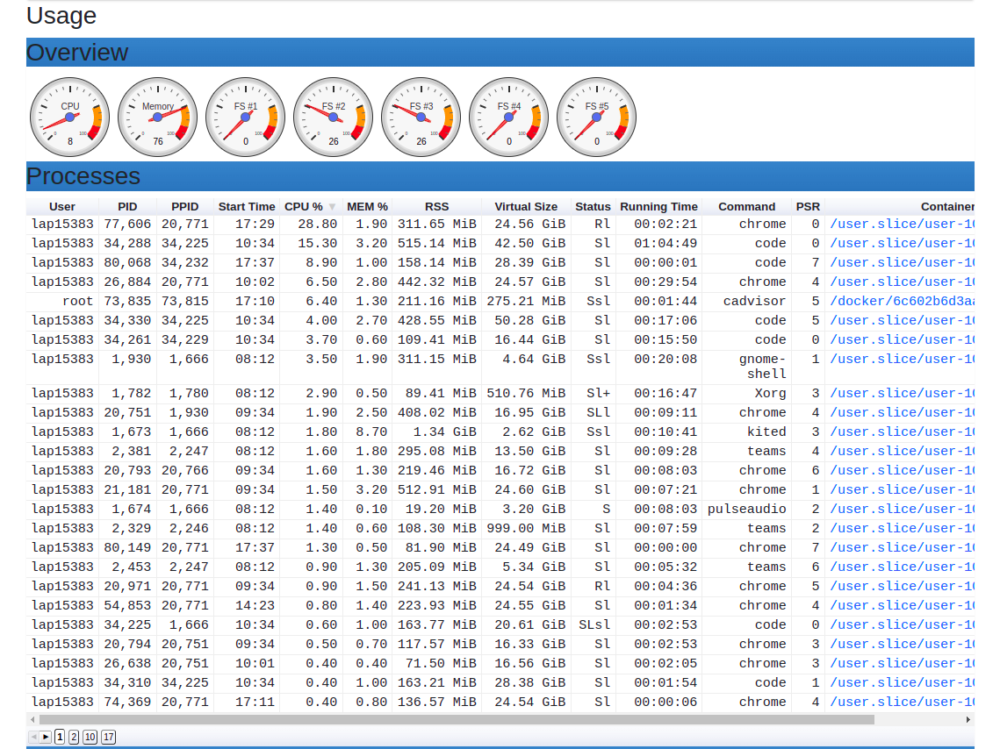

## Elevator Control System

### Author
**Quach Minh Tuan - VNG Tech Fresher 2022 Program**
### Introduction
The elevator project designs for n **elevators**, and m **floors**  using framework **FastAPI** for creating APIs and unittest, pytest, threading,.. This is a backend application for elevator system that allows user call for starting, ending, calling elevator inside and outside. The floor and cabin index is count from 0 and on each floor. In the reality, there will be one panel on each floor for customers to send their request by clicking button (outside) or clicking the floor_number button (inside) and it will indirectedly call API for system.
### Usage
#### Prerequisite
Already install `Docker` and `Docker Compose` with lastest version and post installation of `Docker`.
#### Build and Run server
```bash
docker-compose up -d # Build container
docker ps -a # See all the container that running
docker logs elevator_system --follow # Keep live monitor console
```
#### Terminate server
```bash
docker kill elevator_system # Terminate the system
```

#### Testing
```bash
docker exec elevator_system pytest test # Test using pytest
```

### APIs

#### 1. Start the system
```bash
POST:  "http://tuanqm.duckdns.org:8000/start-system/{floor_number}/{elevator_number}"
```
**Note:** `floor_number` and `elevator_number` must be the positive integer (>0). We should call when system is off and we want to start it.

#### 2. Terminate the system
```bash
POST:  "http://tuanqm.duckdns.org:8000/end-system"
```
**Note:** We should call when system is on and we want to terminate it.
#### 3. Call elevator from inside
```bash
POST:  "http://tuanqm.duckdns.org:8000/inside/{floor_number}/{elevator_number}"
```
**Note:** `floor_number` and `elevator_number` must be the positive integer (>0). We only call when the system is on and we want the cabin with id `elevator_number` that will go to floor `floor_number`.
#### 4. Call elevator from outside
```bash
POST:  "http://tuanqm.duckdns.org:8000/outside/{floor_number}"
```
**Note:** `floor_number` must be the positive integer (>0). We only call when the system is on and we want to get in to elevator from the floor `floor_number`.

### APIs notes

**1.** We can replace the domain `tuanqm.duckdns.org` to IP address `52.77.254.160` (It can change each time we restart the instance of VPS version.)
<!-- http://127.0.0.1:8000 -->

**2.** We can call a API via command `curl`:
```bash
curl -X <HTTPS method> <URL>
```
For example, we want to call a elevator outside from floor 3, we call API like this:
```bash
curl -X "POST" "http://tuanqm.duckdns.org:8000/outside/3"
```

**3.**  We can read API with more eye-catching UI due to the automatic interactive API documentation from FastAPI framework which is support by **Swagger UI**, **ReDoc**. http://tuanqm.duckdns.org:8000/docs or http://tuanqm.duckdns.org:8000/redoc.
  

### Mechanism
If we want to start the system, we firstly need to call API `start-system` with the **number of floors and cabins** that we want to setup as 2 path parameters. Now the system's state will **turn on** and we can call the APIs for elevator *inside* and *outside*. In `inside` API, we can call the elevator from the inside of the elevator, so that the parameter must include **floor_number** we want to come and the **elevator_id**, we are inside it. While `outside` API, we can call the elevator from a floor we are standing, so the parameter must include only the **floor_number**. Finally, if we want end the system in order to waste the resources, we need to call API `end-system` with no params and system's state will **turn off**. In this state, the system will **block** all the APIs that call to elevator.


### Explaination
#### 1. Algorithms
- `start-system`: Setup all the variable such as list elevator, list floor,.. as default variable or value in parameter. Turn on the flag **is_running**.  
- `end-system`: Turn off the flag **is_running**
- `inside`: Create the object **Request** and push to the floor queue. If the floor queue is empty, it will ping a signal to the elevator that query picked. The signal will add into the that elevator's queue. In the same period, the elevator still come to the floor in the front ping in the queue and pop it out, it do this operation until the its request queue is empty. The queue request of queue that the elevator comes will release, means it will pop all elements out of queue and set the flag **is_done** these Request object into True. All the while, the user still keep track the flag **is_done** of the Request object. At the time it changes to True value, this request will release and done task. The message **successful** will return in user's terminal
- `outside`: The algorithm works same as `inside` but complex because we don't have the specifying elevator or which elevator will comes to this floor. In this algorithm, we will compare the number of request in each elevator's queue. So, we will choose the elevator that have minimum request randomly if it exists cases that the number of requests is equal the minimum one.

**Self-evaluate:** This algorithm seems easy to understand, it just a FCFS(First come first serve), the order to serve depends on the order a floor ping to elevator. There is no special priority in this cases. But this algorithm can be update more in the criteria when **choosing** which elevator will come in `outside` API and the **journey** running with the specified list of request. About choosing elevator, we can optimize by calculate the lenght of road of all elevator to this floor and choose the minimun one. While with the journey, I think we can use some special data structure such as **Hash table** or **Segment tree** for keep track the interval between the source floor and target floor we will come instead of ignore it and waiting for the next turn. **For example**, elevator is going from floor 25 to 50 and suddenly we receive the request from floor 40. In my algorithm, we must go in order 25-50-40 (35 steps) and make the user at floor 40 waits (35 steps), but in optimal way, we can re-order it into 25-40-50 (25 step) and user in floor 40 will just waits (15 steps). 
#### 2. Class diagram


#### 3. Race condition
In this project, we used `thread` for handling the multiple elevators. So, the problem about race condition will be occur. To deal with this problem, we use `Lock` class in threading module in Python which is implemented using a Semaphore object provided by the Operating System.

**Lock class** provides 2 method:
+ `acquire()`: To acquire a lock
+ `release()`: To release a lock

To apply this technique, in `run()` of each elevator, elevator afftect to `setting.LIST_FLOOR` - a global variable. So we can bounding it by 2 function **acquire** and **release**. 

  
### Step-by-step project processing

#### 1. Configure the network group
At fisrt, we can see that we cannot ping to that public IP address. To solve this, we go to https://ce.engineering.vng.vn/ce/instances **website** and configure the `Security Group`. 
  
In the details of security group, in the part `Ingress Rule`, we add new **Protocol**.
  
After this step, we can check it works by `ping` to this IP Address.
  
#### 2. Create a domain
I use https://www.duckdns.org/domains **website** in order to create a new domain for my own. Next mapping the new domain with `Current public IP`. In my case, I create new domain named **tuanqm.duckdns.org** and map it to public IP address of my VPS  **52.77.254.160**.
  
Now we can test this domain by `ping` to this domain. 
  

#### 3. Download docker-compose on VPS
```bash
sudo apt install docker-compose # normal installation
# Post-install on linux
sudo groupadd docker
sudo usermod -aG docker $USER
newgrp docker 
docker run hello-world
```
#### 4. Configure the firewall on VPS server
Now, we will use `ufw` library to setup a **Firewall** on Ubuntu 18.04 in **VPS server**.
```bash
sudo apt install ufw # Install
sudo ufw allow <port-number> # Allowing SSH by Port Number
sudo ufw enable # Enabling UFW
```

#### 5. Copy and setup source code
```bash
scp -r elevator ubuntu@52.77.254.160:/home/ubuntu # On working directory in local
# Go to VPS server
cd elevator
docker-compose up -d
docker ps # Check the elevator-system container is running or not
docker logs elevator-system --follow
```
Now we can keep tracking the state of elevator system by terminal and console log it prints real-time.
#### 6. Terminate the system
```bash
docker kill <container-id>
```

### Monitor
#### 1. Prometheus
Access with port `9090`
  
#### 2. cAdvisor
Access with port `8080`
  


### Conclusion
- It works well on the local machine as well as VPS server.
- We tested the program (unittest, API,...).
- Write a public API and well API documentation.
- Create a domain for my own.
- Deploy it using Docker.
- Integrating with monitoring (Prometheus, Grafana, cadvisor).


